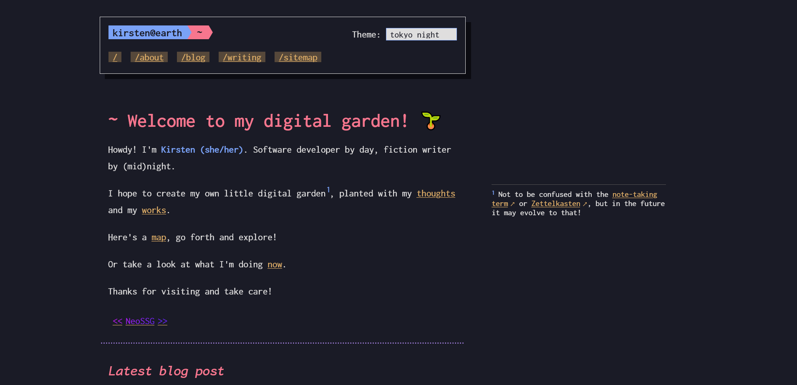

# 10kph.neocities.org

Welcome and take a gander at the source code for my [Neocities website](https://10kph.neocities.org). Note that some of the pages are not committed here, due to the content. (Which is also why this is hosted on my throwaway account.)

Don't know where to start? Try [index.md](./src/index.md). Or [base.njk](./src/_includes/base.njk).

For your browsing experience, please click **Code** at the top of a Markdown file instead of **Preview**.

The site is built with 11ty and TufteCSS as a base. See more info on [site credits](https://10kph.neocities.org/about/#site-credits).

## Preview

Website layout as of 2023-05-29

## Getting started

I'm not sure why you'd want to do this but here are instructions on how to create a clone of my website on your local machine:

1. Make sure you have latest stable Node.js version installed
2. Clone the repo with `git clone https://github.com/tencurse/neocities.git`
3. Go to the project directory via command line `cd neocities`
4. Run `npm install`
5. Run `npm start`
6. Go to `localhost:8080` on your browser
7. ???
8. Profit (Don't actually do this step.)

If you'd like to get the generated static site, run `npm build`. The files will be in the `public` folder.

## Feedback

Found a bug? Any accessibility or design issues? I am open to any and all suggestions! Let me know [here](https://github.com/tencurse/neocities/issues) or email me at 10kph@pm.me

Or [contribute](https://github.com/tencurse/neocities/pulls) to the site.
